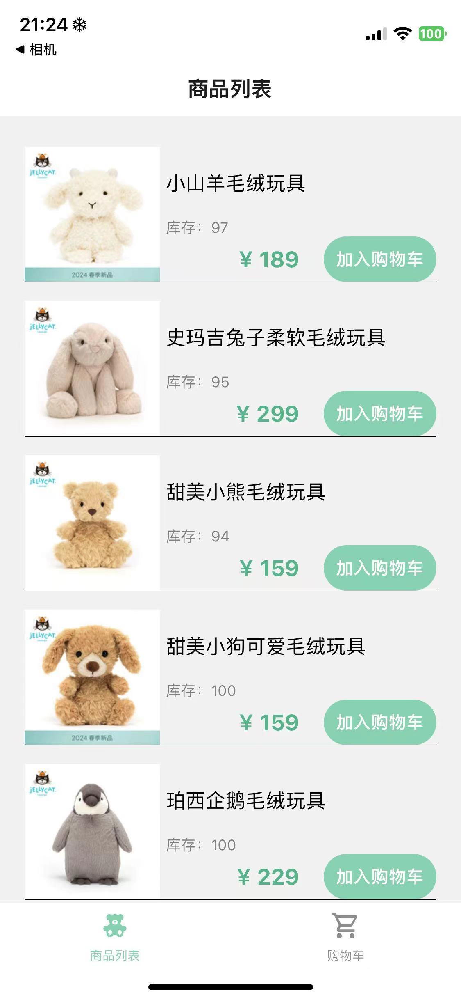
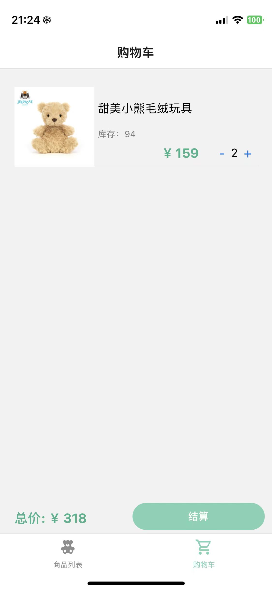

# 购物小程序

## 项目介绍
本项目是携程前端训练营第二节课React Native开发的课程作业。

- 作业要求：
    1. 商品列表：显示可购买的商品列表，每个商品有自己的名称、价格和“添加到购物车”按钮
    2. 购物车：可以查看购物车，购物车应显示用户已添加的商品、每个商品数量、单个商品价格和购物车总价。用户应该可以添加或减少购物车中商品的数量，或者从购物车中完全移除商品
    3. 结账：用户可以进行结账操作，结账后购物车应该清空(模拟异步请求)，对对应库存进行处理
    - 商品可通过fetch走本地json数据
    - 样式自定义

## 环境依赖
```
node v18.19.0
npm 10.2.3
```

其它依赖通过`npm install`安装即可

## 目录结构
```
├── App.js
├── README.md
├── app.json
├── assets
│   ├── adaptive-icon.png
│   ├── favicon.png
│   ├── icon.png
│   └── splash.png
├── babel.config.js
├── component   //组件
│   ├── Cart    //购物车组件
│   │   └── index.js
│   ├── DataList.json   //数据
│   └── Home    //商品列表
│       ├── ShowItem.js //单个商品组件
│       ├── ShowProduct.js  //商品列表组件
│       └── index.js    //商品列表页面
├── package-lock.json
└── package.json
```

## 使用说明
进入APP后，首页会展示所有的商品信息，点击旁边的“加入购物车”按钮即可将物品加入购物车，加入购物车默认添加一个物品到购物车中，连续点击会加入多个商品。如果商品库存为0，则无法添加至购物车。


点击页面下方的导航栏，可跳转到购物车页面,在购物车页面，可通过点击物品旁边的加号/减号增减物品个数(不超过库存数量)，底部会实时更新购物车中的商品总价，长按可以直接删除购物车中的某个物品。点击下方的“结算”即可清空购物车，相应的库存也会减少。


## 声明
本次项目中的素材图片均源于网络，仅作学习用途 