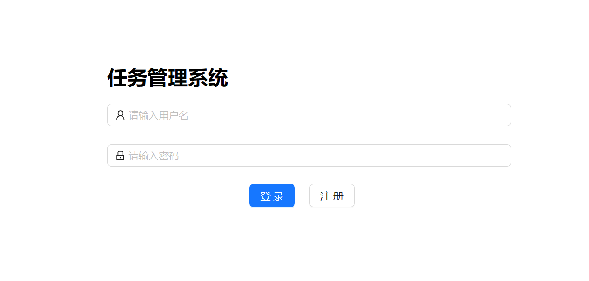
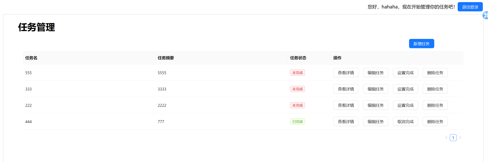

# 后端开发-任务管理系统数

本项目使用nodejs express搭建后端，MongoDB数据库以及create-react-app搭建前端，前端使用Antd进行美化。

## 作业要求以及具体实现
1. 简单任务管理系统，实现用户注册、登录、创建任务、查看任务、编辑任务等功能
2. 任务管理系统数据结构：包括用户、任务等
    - 实现：创建了用户、任务和session三个数据库
3. MongoDB数据库，创建新的数据库并且连接到Nodejs项目中
    - 使用mongodb进行数据库的操作
4. 实现用户注册和登录功能包括表单验证、密码加密
    - 实现：密码加密采用前端post明文传输，后端AES加密的形式(使用crypto-js)，由于是demo因此没有限制https传输，实际使用https的post方法 更为安全
5. session和cookie实现登录状态保持
    - 使用express-session
    - 实现：登录界面自动向后端请求，查看session是否有效，如果有效直接跳转界面；session存储在数据库中
6. 任务创建、查看、编辑功能，包括任务列表、任务详情等页面渲染
7. 学习如何使用表单验证和数据存储，确保任务数据的有效性和一致性

- 由于时间紧迫，本次作业用到的一些方案并非最好做法，还存在很多漏洞，在之后的学习和实操过程中我会争取将登陆状态保持、登录等功能变得更加完善

## 项目结构
```
├── README.md
├── backend-demo    //后端代码
│   ├── components
│   │   └── crypto.js   //密码加密
│   ├── index.js    //后端主要代码
│   ├── package-lock.json
│   └── package.json
└── frontend-demo
    ├── README.md
    ├── package-lock.json
    ├── package.json
    ├── public
    │   ├── favicon.ico
    │   └── index.html
    └── src
        ├── App.js
        ├── components
        ├── index.js
        ├── pages
        │   ├── login   //登录界面
        │   │   ├── index.css
        │   │   └── index.js
        │   └── task    //任务管理界面
        │       ├── index.js
        │       ├── manage.js
        │       └── topbar.js
        ├── setupTests.js
        └── utils
            └── utils.js    //调用存储的功能函数
```
## 数据库字段说明
```
任务数据表task ：_id tname(任务名) tdetail(任务细则) tdone(是否完成) uname(任务所属人)
用户数据表user：_id username(用户名) password(密码)
sessions：_id expires session
```
## 环境依赖
```
node  v18.19.0
npm  v10.2.3
MongoDB 7.0.6
其它包依赖均可以在package-lock.json查看
```

## 项目启动说明
```
后端代码：
cd backend-demo
node index.js
前端代码：
cd frontend-demo
npm start
```

## 使用说明
1. 首页
输入用户名、密码进入系统，如果没有用户名、密码则可以点击注册按钮注册新的账户进入。

如果此前用户登录了系统且没有登出操作，那么进入该页面后，会自动跳转到任务管理界面。


2. 任务管理界面
进入任务管理界面，点击对应的按钮，即可进行相应操作。
