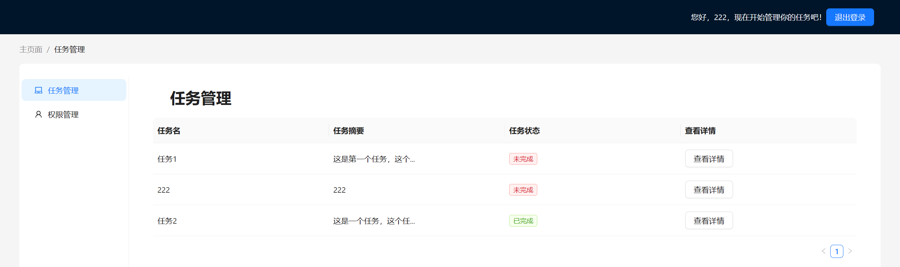

# 中后台系统开发-任务管理系统

本项目使用 nodejs express 搭建后端，MongoDB 数据库以及 create-react-app 搭建前端，前端使用 Antd 进行美化。

## 作业要求以及具体实现

1. 做一个登录页，登录完之后，cookie 种入标识，防止下次再重复登录(提示：cookie 有过期时间)
   - 用户登录成功后，前端会在 cookie 中写入一个 username 数据，用于记录用户已登录，同时设置 cookie 的过期时间为 7 天
   - 这里前端做的比较简单，只是写入了 username，如果用户修改了 cookie 是会有安全问题的
   - 本系统还在localStorage 中存储了用户以及用户的权限信息
2. 设计一个权限管理，然后给 1 中用户分配一些权限
   - 本系统的权限系统如下：分为管理员和用户两个角色
     - 管理员类型 a：管理用户对任务的操作权限
     - 任务用户类型 u0 u1 u2：对任务的操作权限不同
       - 权限 u0: 可查看 可编辑 可新增、删除
       - 权限 u1：可查看 可编辑
       - 权限 u2：仅查看
3. 做一个列表页和表单填写页
   - 本系统将列表页和表单填写页进行了结合，将表单制作成了弹窗
   - 一个任务管理页面：主页显示列表，点击编辑/新增的按钮之后会弹出表单填写的页面
   - 一个用户管理页面：主页显示列表，点击编辑/新增的按钮之后会弹出表单填写的页面

## 项目结构

```
├── README  //readme图片
│   ├── image-1.png
│   └── image.png
├── README.md
├── backend-demo    //后端代码
│   ├── components
│   │   └── crypto.js   //密码加密
│   ├── index.js    //后端主要代码
│   ├── package-lock.json
│   └── package.json
└── frontend-demo
    ├── README.md
    ├── package-lock.json
    ├── package.json
    ├── public
    │   ├── favicon.ico
    │   └── index.html
    └── src
        ├── App.js
        ├── components
        ├── index.js
        ├── pages
        │   ├── admin   //管理员页面
        │   │   ├── admin.js
        │   │   └── manage.js
        │   ├── login   //登录页面
        │   │   ├── index.css
        │   │   └── index.js
        │   ├── mainpage.js //主页(切换显示管理员和任务管理页面)
        │   ├── task    //任务管理页面
        │   │   ├── index.js
        │   │   └── manage.js
        │   └── topbar.js   //顶部导航栏文字以及推出登录按钮
        ├── setupTests.js
        └── utils
            └── utils.js    //调用存储的功能函数
```

## 数据库字段说明

```
任务数据表task ：_id tname(任务名) tdetail(任务细则) tdone(是否完成) uname(任务所属人) member(表示任务成员，Array类型)
用户数据表user：_id username(用户名) password(密码) permission(权限)
sessions：_id expires session
```

## 环境依赖

```
node  v18.19.0
npm  v10.2.3
MongoDB 7.0.6
其它包依赖均可以在package-lock.json查看
```

## 项目启动说明

```
后端代码：
cd backend-demo
npm install
node index.js
前端代码：
cd frontend-demo
npm install
npm start
```

## 使用说明

1. 首页
   输入用户名、密码进入系统，如果没有用户名、密码则可以点击注册按钮注册新的账户进入。

    如果此前用户登录了系统且没有登出操作，那么进入该页面后，会自动跳转到任务管理界面。
    

    点击注册按钮后，会出现以下弹窗，用户可以注册响应身份账号

    

2. 任务管理界面
    进入任务管理界面，点击对应的按钮，即可进行相应操作。如果权限为u0或者管理员，则拥有所有对任务操作的功能没页面如下图
    

    如果权限为u1，则没有新增删除权限
    

    如果权限为u2，则只有查看权限
    

    点击任务详情，可以看到任务的具体内容，表单中内容不可编辑：
    

    点击修改/新增任务，会跳出对应的可编辑的表单：
    

    
3. 用户管理界面
    该界面仅管理员可见，如果其他用户访问该页面，则会显示“无权访问当前页面“的字样。
    

    管理员可以在该页面对用户的权限进行更改，也可以新增或者删除用户
    
