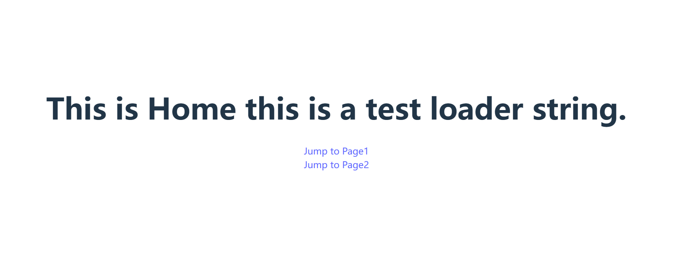
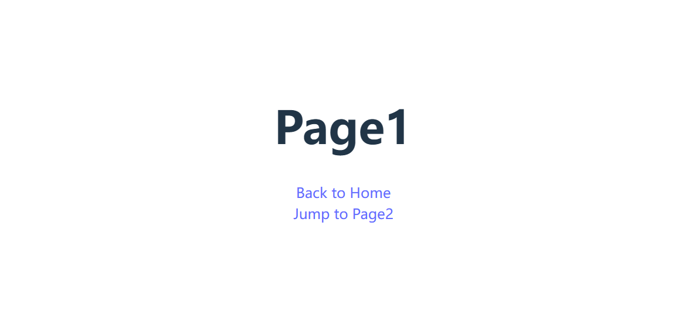
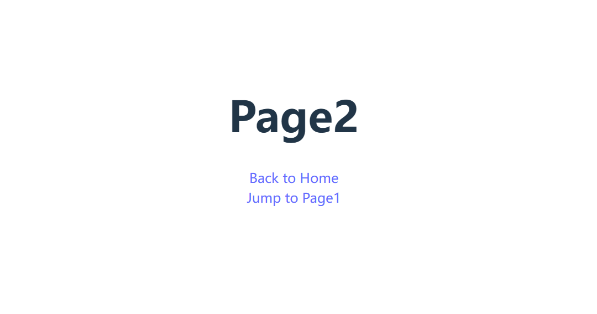
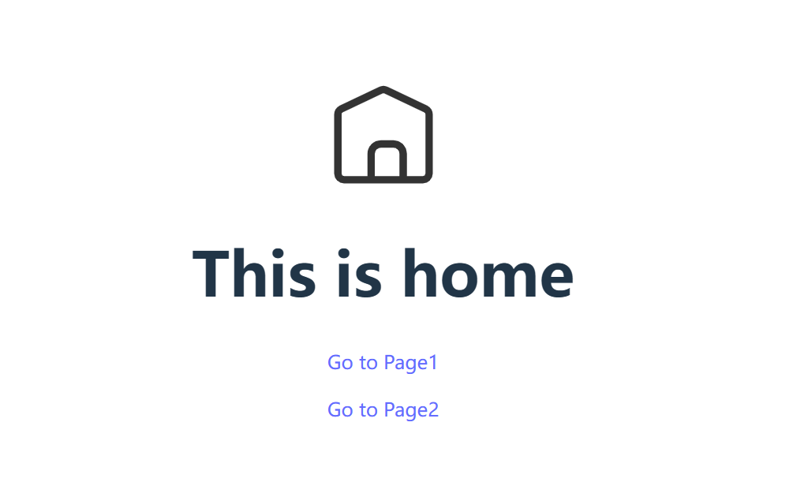
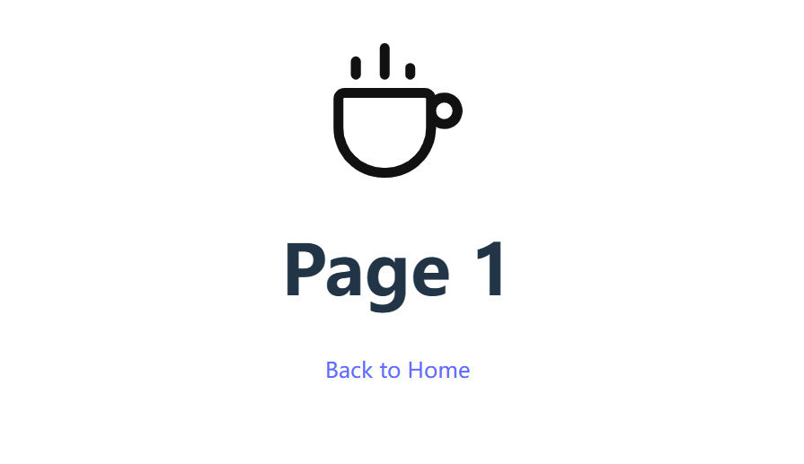
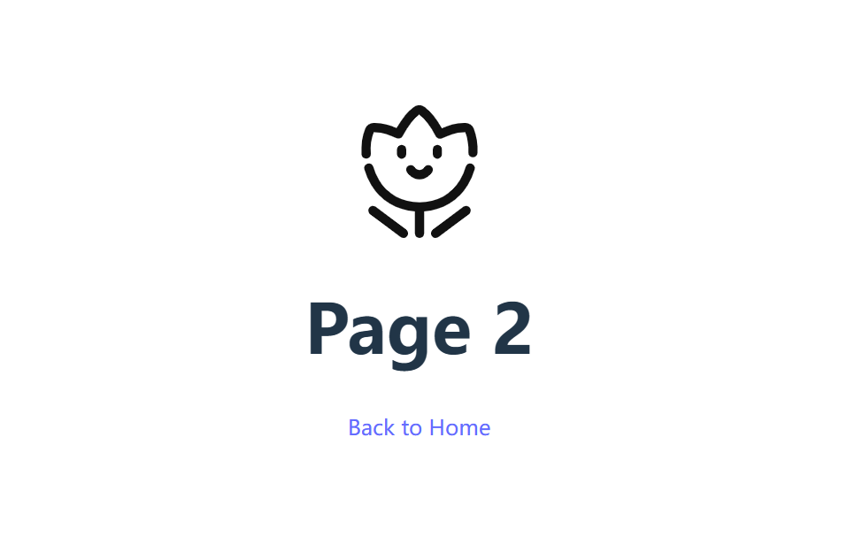

# 进阶课6-前端构建工具

## 作业要求以及具体实现
1. 做两个demo: 
    1. react+webpack+less+typescript;
        - 安装react，使用命令npm i react react-dom react-router-dom -D
        - 安装webpack，使用命令npm i webpack webpack-cli webpack-dev-server webpack-merge -D
        - 安装less及相关依赖，使用命令npm i postcss postcss-loader postcss-preset-env style-loader css-loader less-loader less mini-css-extract-plugin -D
        - 安装babel相关依赖，使用命令npm i @babel/cli @babel/core @babel/preset-env @babel/preset-react -D
        - 安装typescript相关依赖，使用命令npm i @types/react @types/react-dom ts-loader @babel/preset-typescript -D
    2. vue+vite+less+typescript
        - 使用vite构建项目：npm create vite@latest vue+vite+less+ts --template vue-ts
        - 配置vite配置文件:设置服务器启动端口为8899，设置 @ 指向 src 目录、 服务启动端口、打包路径
2. 每个demo至少含有两个可以跳转的页面
    - webpack：使用react-router-dom完成
        - react:url输入后无法跳转页面？需要在Webpack Dev Server中把所有请求重定向到/index.html，设置publicPath 和 historyApiFallback两个选项
        - webpack打包后，html中显示空白？需要将BrowserRouter 替换为 HashRouter
    - vite：使用vue-router实现路由跳转
3. 使用合适的loader和plugin
    - webpack:使用mini-css-extract-plugin插件将 CSS 提取为独立的文件，使用html-webpack-plugin插件生成html
    - vite： 内部已集成了less相关的 loader ，无需配置；vue3中使用插件vite-plugin-svg-icons（npm i npm i fast-glob vite-plugin-svg-icons）
4. 尝试自定义loader和plugin
    - webpack:自定义简单的plugin：在打包后的目录中输出一个markdown文件，显示打包后的文件名、文件大小；使用了 webpack 的 emit 钩子在即将生成资源到输出目录之前统计要输出的文件名和文件大小
    - webpack:自定义简单的loader：替换源码中的'ATESTLOADERSTRING'为'this is a test loader string.'
    - vite:自定义一个plugin:为文件加上版本号，使用transformIndexHtml钩子，将输出的index.html中的引用内容都增加版本号，使得每次更新打包内容，index.html中的内容可以即时变化

## 项目结构
```
├── 1react+webpack+less+ts  //webpack项目
│   ├── config              //webpack配置
│   │   ├── webpack.base.config.js
│   │   ├── webpack.dev.config.js
│   │   └── webpack.prod.config.js
│   ├── dist                 //打包后的目录
│   │   ├── filename.md
│   │   ├── index.html
│   │   ├── index.js
│   │   ├── index.js.LICENSE.txt
│   │   └── index.min.css
│   ├── mypluginandloader   //自定义plugin和loader
│   │   ├── myloader.js
│   │   └── myplugin.js
│   ├── package-lock.json
│   ├── package.json
│   ├── src                 //demo源码
│   │   ├── App.less
│   │   ├── App.tsx
│   │   ├── component
│   │   │   ├── home
│   │   │   │   └── home.tsx
│   │   │   ├── page1
│   │   │   │   └── page1.tsx
│   │   │   └── page2
│   │   │       └── page2.tsx
│   │   ├── index.html
│   │   └── index.tsx
│   └── tsconfig.json   //ts配置
├── 2vue+vite+less+ts   //vite项目
│   ├── dist            //打包后的目录
│   │   ├── assets
│   │   │   ├── index-C48LnJ44.js
│   │   │   ├── index-G4dWLCnP.css
│   │   │   ├── index-legacy-xAo_07_4.js
│   │   │   └── polyfills-legacy-CaavSXOo.js
│   │   ├── index.html
│   │   └── vite.svg
│   ├── index.html
│   ├── package-lock.json
│   ├── package.json
│   ├── plugins         //自定义plugin
│   │   └── myplugin.ts
│   ├── public
│   │   └── vite.svg
│   ├── src             //demo源码
│   │   ├── App.vue
│   │   ├── assets
│   │   │   └── vue.svg
│   │   ├── components
│   │   │   └── svgicon.vue
│   │   ├── icons
│   │   │   ├── garden.svg
│   │   │   ├── home.svg
│   │   │   └── sofa.svg
│   │   ├── main.ts
│   │   ├── router      //路由配置
│   │   │   └── index.ts
│   │   ├── style.less
│   │   ├── views   //页面代码
│   │   │   ├── home.vue
│   │   │   ├── page1.vue
│   │   │   └── page2.vue
│   │   └── vite-env.d.ts
│   ├── tsconfig.json   //ts配置
│   ├── tsconfig.node.json
│   └── vite.config.ts  //vite配置文件
└── README.md
```
## 环境依赖
```
node  v18.19.0
npm  v10.2.3

webpack 5.90.3
vite 5.1.6
其它包依赖均可以在package-lock.json查看
```
## 项目启动说明
```
1react+webpack+less+ts：
cd 1react+webpack+less+ts
npm install
npm run dev
npm run build

2vue+vite+less+ts：
cd 2vue+vite+less+ts
npm install
npm run dev
npm run build
```

## 使用说明
1. 1react+webpack+less+ts
    该项目由三个页面组成，每个页面都有可以跳转路由的按钮，点击可跳转到其他页面
    
    
    
2. 2vue+vite+less+ts
    该项目也由三个页面组成，每个页面都有可以跳转路由的按钮，点击即可跳转
    
    
    